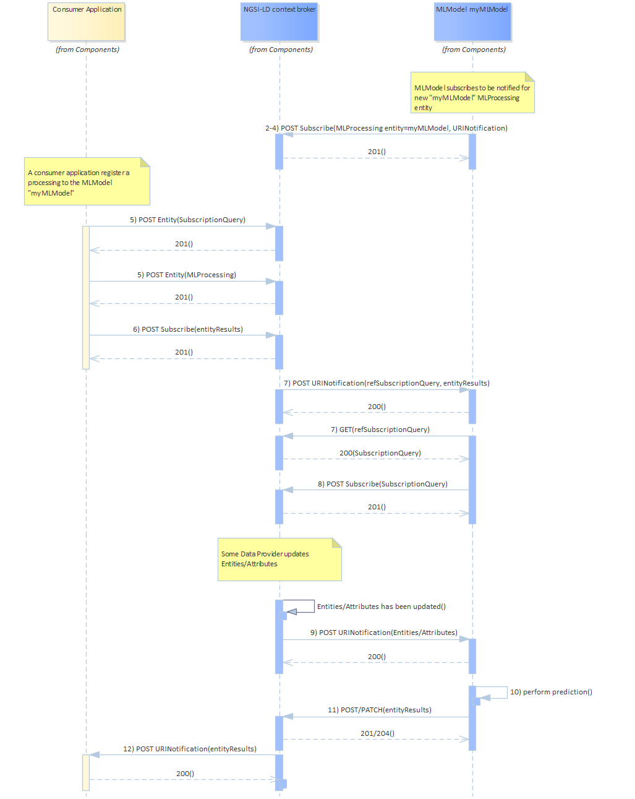

# FIWARE ML as a Service POC
**A simple Proof Of Concept for a FIWARE MLaaS.**

## Concept
This repository contains the code for a conceptual 'Machine Learning as a Service' composant providing prediction service from/to a FIWARE context broker. In a nutshell a MLaaS can be used by a Consumer Application using the following procedure (also described as a sequence diagram below):

* As a prerequisite (flow 2-4), a MLaaS (MLModel) has been deployed and has subscribed to the Context Broker in order to be notified when a consumer application request to use its service. The notification contains a query for the MLaaS to identify the data on which the prediction shall be made.
* A consumer application creates a MLProcessing entity in the context broker (flow 5), which contains a reference to the desired MLaaS and a reference (as a query) to the data on which predictions have to be made.
* Finally the consumer application subscribes to the prediction (data results of the prediction performed by MLaaS)
* The creation of the MLProcessing entity by the consumer app triggers a notification towards MLaaS. The MLaaS uses the content of the notification to find out which data to use for predicting and susbcribe to changes of that data (flow 7-8).
* Whenever that data changes, a notification is received by MLaaS and triggers a prediction (flow 9-10).
* MLaaS saves the prediction into the Context Broker (flow 11)
* Finally the consumer application receives a notification of the predicted data (flow 12).



## What's in this repo?
* **[app.py, ctes.py]**: An implementation of the MLaaS (MLModel), with no real ML model though. The predictions are fake, i.e. simply computed from the input data (an array of 256 float values. "Predicting" is about taking the first value of the array, multiplying it by 1000 and return an int of this value, e.g. **0.165428** will be "predicted" as **165**).
* **[Dockerfile]**: To build a docker for the MLaaS. ***The Docker file expects to find a stellio-dev-access.token file containing the access token to EGM stellio-dev Context Broker***.

## Getting started

* Configure the global variables in `ctes.py`

* Create the MLModel entities (adapt the variables in the file)

```
python3 create_mlmodel.py
```

* List your models to check the creations went fine

```
python3 get_mlmodels.py | jq
```

* For tests purposes, you can manually create a WaterConsumption entity that will hold input data and prediction results

```
python3 create_waterconsumption.py
```

* Add a relationship between the WaterConsumption entity and a previously created MLModel entity

```
python3 add_measure_waterconsumption.py
```

Similarly, you can use the `delete_relationship_to_mlmodels.py` to delete a relationship between a WaterConsumtion entity and a MLModel entity.

* Create a subscription for the BentoML proxy to be notify when there is an update on a WaterConsumption entity

```
python3 create_subscription.py
```

* Update a value on the WaterConsumption entity to trigger a new prediction in the BentoML module

```
python3 add_measure_waterconsumption.py
```

* Update a value in a MLModel entity (e.g. the URL of the BentoML module)

```
python3 update_mlmodel_attribute.py
```
